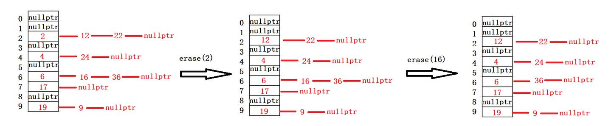
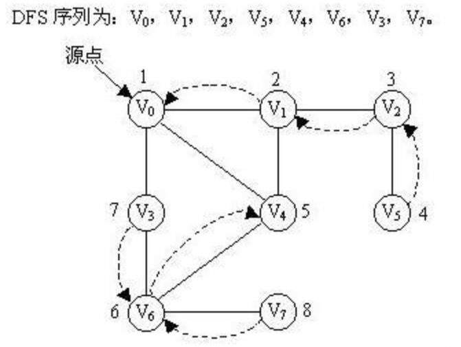

# Acwing-学习记录
## 基础算法
### 快速排序(时间复杂度`o(nlog2n)`)
1. 确定分界点`q[l]`,`q[2]`或者`q[(l+r)/2]`
2. 分段排列保证数组q前半段数字全部小于等于分界点，后半段全部大于等于分界点
   * 暴力法 (空间复杂度`o(n)`)
   * 双指针法 (空间复杂度`o(1)`)
3. 递归排序前半段与后半段
[快排模板](./代码模板/基础算法/快排.cpp)
### 归并排序(时间复杂度`o(nlog2n)`)
1. 确定分界点`q[(l+r)/2]`
2. 对左半段`(l,mid)`与右半段`(mid+1,r)`进行递归
3. 归并左半段与右半段(空间复杂度`o(n)`)
[归并排序模板](./代码模板/基础算法/归并排序.cpp)
### 二分查找(时间复杂度`o(nlog2n)`)
1. 整数二分
   1. 确定分界点mid，`mid=(l+r)/2`或者`mid=(l+r+1)/2`当需要将left更新为mid时使用`mid=(l+r+1)/2`
   2. 实现check函数，根据check函数重新确定区间
      + 当需要寻找值的左边界
        + 若`q[mid]<x`则目标区间应该在`[mid+1,right]`之中将`left=mid+1`
        + 若`q[mid]>=x`则目标区间应该在`[left,mid]`之中将`right=mid`
      + 当需要寻找值的右边界
        + 若`q[mid]<=x`则目标区间应该在`[mid,right]`之中将`left=mid`
        + 若`q[mid]>x`则目标区间应该在`[left,mid-1]`之中将`right=mid-1`
[整数二分查找模板](./代码模板/基础算法/整数二分查找.cpp)   
2. 浮点数二分
   浮点数二分较为简单可以直接看模板[浮点数二分查找模板](./代码模板/基础算法/浮点数二分.cpp) 
### 双指针算法
1. 对于两个序列，维护某种次序，比如归并排序中合并两个有序序列的操作
2. 对于一个序列，用两个指针维护一段区间
```
for (int i = 0, j = 0; i < n; i ++ )
{
    while (j < i && check(i, j)) j ++ ;
    // 具体问题的逻辑
}
```
[799. 最长连续不重复子序列](https://www.acwing.com/problem/content/description/801/)

### 位运算
1. 求n的第k位数字: `n >> k & 1`
2. 返回n的最后一位1：`lowbit(n) = n & -n`(`-n`是`n`取反之后加1，位与之后就可以得到n的最后一位1，例:`n=0110100`则`-n=1001100`,`n&-n=0000100`得到最后一位1处于第三位)

## 数据结构
### 链表与邻接表
1. 单链表：利用邻接表可以存储树与图
   [数组模拟单链表模板](./代码模板/数据结构/数组模拟单链表.cpp)
   [826. 单链表](https://www.acwing.com/problem/content/828/)
2. 双链表
   [数组模拟双链表模板](./代码模板/数据结构/数组模拟双链表.cpp)
   [827. 双链表](https://www.acwing.com/problem/content/829/)
### 栈与队列
1. 栈
   [数组模拟栈模板](./代码模板/数据结构/数组模拟栈.cpp)
   [828. 栈](https://www.acwing.com/problem/content/830/)
2. 普通队列
   [数组模拟普通队列模板](./代码模板/数据结构/数组模拟普通队列.cpp)
   [829. 队列](https://www.acwing.com/problem/content/831/)
3. 循环队列
   [数组模拟循环队列模板](./代码模板/数据结构/数组模拟循环队列.cpp)
   [829. 队列](https://www.acwing.com/problem/content/831/)
4. 单调栈
   [数组模拟单调栈模板](./代码模板/数据结构/数组模拟单调栈.cpp)
   [830. 单调栈](https://www.acwing.com/problem/content/832/)
   应用场景比较有限一般用于左边第一个比他小或者比他大的数
5. 单调队列
   [数组模拟单调队列模板](./代码模板/数据结构/数组模拟单调队列.cpp)
   [154. 滑动窗口 ](https://www.acwing.com/problem/content/156/)
6. 常用stl简介
   [常用stl](./代码模板/数据结构/常用stl.md)
### KMP
1. 确定next数组
  next数组是用于记录模板串回溯的大小假设模板串为```T[n]```,则```next[i]```就代表着```T[0...i-1]```的子串的最长公共真前后缀的长度,假设```next[i]=k```,则```T[0...k-1]```与```T[i-k...i-1]```相等。
  知道以上条件后我们来推推如何通过代码的方式得到整个next数组：
  首先一定有```next[0]=-1```和```next[1]=0```我们不妨设我们已知```next[i]=k```去求```next[i+1]```
   * ```T[k]=T[i]```:则易得```next[i+1]=k+1```
   * ```T[k]!=T[i]```:此时我们记$k_1$=```next[k]```,于是有```T[0...k1-1]=T[k-k1...k-1]```又因为```T[0...k-1]=T[i-k...i-1]```，故有```T[0...k1-1]=T[k-k1...k-1]=T[i−k...i−k+k1​−1]=t[i−k1​...i−1]```,即```T[0...k1−1] = T[i−k1...i−1]```。若```T[k1]```=```T[i]```,则根据情况1，```T[i+1]==K1+1```,否则另$k_2$=```next[k1]```，重复情况2，若在某一步发现$k_n$=-1，则表示已回溯到串头，则```next[i+1]=0```。可得求next数组如下
   ```
   vector<int> GetNum(string T){
         vector<int> next(T.size());
         next[0]=-1;
         int k,i=0;
         while(i<T.size()-1){
            k=next[i];
            if(T[i]==T[k]||k==-1){
                next[i++]=k+1;
            }
            else
                k=next[k];
         }
         return next;
   }
   ```
2. 根据next数组写KMP算法
```
int kmp(string &s,string &t) {
    vector<int> next = GetNext(t);
    int i = 0,j = 0;
    while (i < s.size() && j < (int) t.size()) {
        if (j == -1 || s[i] == t[j]) i++, j++;
        else j = next[j];
    }
    if (j == t.size()) return i - j;
    else return -1;
}
```
[KMP模板](./代码模板/数据结构/KMP.cpp)
[831. KMP字符串](https://www.acwing.com/problem/content/833/)  
[参考博客](https://blog.csdn.net/raelum/article/details/128823560)

### Trie树
【字典树】(Trie Tree) 是一种树形结构，是一种哈希树的变种。典型应用是用于统计，排序和保存大量的字符串（但不仅限于字符串）。
它的优点是：利用字符串的公共前缀来减少查询时间，最大限度地减少无谓的字符串比较，查询效率比哈希树高。

代码模板可看
[Trie树代码模板](./代码模板/数据结构/Trie树.cpp)
有插入和寻找两个方法
[835. Trie字符串统计](https://www.acwing.com/problem/content/837/)

### 并查集
并查集是一种树型的数据结构，用于处理一些不相交集合的合并及查询问题（即所谓的并、查）。比如说，我们可以用并查集来判断一个森林中有几棵树、某个节点是否属于某棵树等。

主要构成：
并查集主要由一个整型数组pre[ ]和两个函数find( )、join( )构成。
数组 pre[ ] 记录了每个点的前驱节点是谁，函数 find(x) 用于查找指定节点 x 属于哪个集合，函数 join(x,y) 用于合并两个节点 x 和 y 。

作用：
并查集的主要作用是求连通分支数（如果一个图中所有点都存在可达关系（直接或间接相连），则此图的连通分支数为1；如果此图有两大子图各自全部可达，则此图的连通分支数为2……）

1. find函数
```
int find(int x){
    if(pre[x]!=x)
        pre[x] = find(pre[x]);
    return pre[x];
}
```
这个find函数进行了路径优化，最后所有子节点都会挂载在同一个父节点之下


1. join函数
```
bool join(int x,int y){
    int pre_x = find(x);
    int pre_y = find(y);
    if(pre_x == pre_y)
        return false;
    //将节点少的挂在节点多的下面
    if(my_rank[pre_x]>my_rank[pre_y]){
        my_rank[pre_x]+=my_rank[pre_y];
        pre[pre_y] = pre_x;
    }
    else{
        my_rank[pre_y]+=my_rank[pre_x];
        pre[pre_x] = pre_y;
    }
    return true;
}
```
将节点少的分支挂载到节点多的分支下面可以优化寻找
[并查集代码模板](./代码模板/数据结构/并查集.cpp)
[837. 连通块中点的数量](https://www.acwing.com/problem/content/839/)

### 模拟堆排序
$~~~~~~$堆排序的时间复杂度O($N*\log{N}$),额外空间复杂度O(1)，是一个不稳定性的排序,堆的结构可以分为大根堆和小根堆，是一个完全二叉树，而堆排序是根据堆的这种数据结构设计的一种排序。
$~~~~~~$性质：每个结点的值都大于其左孩子和右孩子结点的值，称之为大根堆；每个结点的值都小于其左孩子和右孩子结点的值，称之为小根堆。如下图:

堆映射的数组如下

父结点索引：(i-1)/2（这里计算机中的除以2，省略掉小数）
左孩子索引：2*i+1
右孩子索引：2*i+2
如果栈顶编号从1开始则：
父结点索引：(i)/2（这里计算机中的除以2，省略掉小数）
左孩子索引：2*i
右孩子索引：2*i+1
堆排序步骤:
1. 首先将待排序的数组构造成一个大根堆，此时，整个数组的最大值就是堆结构的顶端(如果是想要降序排列的话就使用小根堆，后续步骤一致)
2. 将顶端的数与末尾的数交换，此时，末尾的数为最大值，剩余待排序数组个数为n-1
3. 将剩余的n-1个数再构造成大根堆，再将顶端数与n-1位置的数交换，如此反复执行，便能得到有序数组

堆的构造可以参考博客[堆排序算法（图解详细流程）](https://blog.csdn.net/u010452388/article/details/81283998)

### 一般哈希
$~~~~~~~$哈希表又称散列表，一种以[key-value]形式存储数据的数据结构。所谓以[key-value]形式存储数据，是指任意的键值 key 都唯一对应到内存中的某个位置。只需要输入查找的键值，就可以快速地找到其对应的 value。可以把哈希表理解为一种高级的数组，这种数组的下标可以是很大的整数，浮点数，字符串甚至结构体。
1. 哈希冲突
注意到当$k_i \neq k_j$时是有可能出现 $h(k_i) = h(k_j)$的，这种现象称为哈希冲突。我们将具有不同关键字但具有相同哈希地址的元素称为「同义词」，这种冲突也称为同义词冲突。在一般的哈希表中哈希冲突是很难避免的，但我们又不得不解决冲突，否则后面插入的元素会覆盖前面已经插入的元素。解决冲突的方法有很多，可分为「开放寻址法」和「拉链法」两大类
2. 哈希函数设计
构造哈希函数的目标是使得到的n个元素的哈希地址尽可能均匀地分布在m个连续内存单元地址上，同时使计算过程尽可能简单以达到尽可能高的时间效率。
构造哈希函数有许多种方法，这里只介绍最常用的[除留余数法]
不妨设哈希表要存储的元素个数为n,于是我们可以开一个长度为n的数组并定义
$$h(k) = k {\kern 2pt} mod {\kern 2pt} p$$
其中```p```是不大于n且最近就n的**质数**
但这样做的弊端在于，如果n不是质数（通常都不是），则有$$0\leq h(k) \leq p-1 < n-1$$从而一定会造成哈希冲突。为避免这一现象，我们可以寻找大于等于n且最接近n的**质数**，不妨设为m，然后开一个长度为m的数组并取$p=m$。
注意到k可能是负数，因此我们需要将哈希函数修改成
$$h(k) = (k{\kern 3pt}mod{\kern 3pt}m + m){\kern 3pt}mod {\kern 3pt}m$$
来确定$h(k)\geq 0$
3. 如何解决哈希冲突
   * 开放寻址法:开放寻址法就是在插入一个关键字为k的元素时，若发生哈希冲突，则通过某种哈希冲突解决函数（也称为再哈希）得到一个新空闲地址再插入该元素的方法。
$~~~~~~~$再哈希的设计有很多种，常见的有「线性探测法」和「平方探测法」，本文只讲解前者，后者可类比得到。线性探测法是从发生冲突的地址开始，依次探测下一个地址，直到找到一个空闲单元为止。当到达下标为m − 1的哈希表表尾时，下一个探测地址是表首地址0。当 m ≥ n 时一定能找到一个空闲单元。使用开放寻址法时，m通常取n的 2 ∼ 3倍左右。例如若$n \leq 10^5$则我们可以取上表中的196613作为哈希表的大小。
$~~~~~~~$线性探测法的优点是解决冲突简单，但一个重大的缺点是容易产生堆积问题。平方探测法虽然可以避免出现堆积问题，但是其不一定能探测到哈希表上的所有单元（至少能探测到一半单元)
   * 拉链法：拉链法是把所有的同义词用单链表链接起来的方法。在这种方法中，哈希表的每个单元存储的不再是元素本身，而是相应同义词单链表的头指针（注意是头指针而不是头节点）。
$~~~~~~~$对于单链表，我们可以采用数组的方式进行实现。此外，使用拉链法时，m的大小通常和n差不多。例如，若$n \leq 10^5$，我们可以寻找大于等于$10^5$的第一个质数，即 m = 100003 

[参考博客](https://blog.csdn.net/raelum/article/details/128793474)
[840. 模拟散列表](https://www.acwing.com/problem/content/842/)

### 字符串哈希
字符串Hash，其实就是：构造一个数字使之唯一代表一个字符串。但是为了将映射关系进行一一对应，也就是，一个字符串对应一个数字，那么一个数字也对应一个字符串。
用字符串Hash的目的是，我们如果要比较一个字符串，我们不直接比较字符串，而是比较它对应映射的数字，这样子就知道两个“子串”是否相等。从而达到，子串的Hash值的时间为 O(1)，进而可以利用“空间换时间”来节省时间复杂的。
1. 构造哈希函数：
假如给你一个数字1166，形式上你只知道它只是1和6的组合，但你知道它代表的实际大$1*10^3+1*10^2+6*10^2+6*10^0$。
同理，给你一个字符串，要把它转换为数字，就可以先把每一个字符都先对应一个数字，然后把它们按照顺序乘以进制（Base）的幂进行相加，然后这个数可能很大，所以一般会取余数（MOD）。
首先给定一个字符串$S=S_1S_2S_3...S_n$对于每一个$S_i$就是一个字母我们规定$idx(S_i)=S_i-‘a’+1$等于其ascii值，其中分为三种构造
   *  自然溢出法
      $~~~~~~$对于自然溢出方法，我们定义 Base ，而MOD对于自然溢出方法，就是 unsigned long long 整数的自然溢出（相当于MOD 是 $2^{64} - 1$）。
      ```
      #define ull unsigned long long
      ull Base;
      ull hash[MAXN], p[MAXN];
      hash[0] = 0;
      p[0] = 1;
      ```
      定义了上面的两个数组，首先 hash[i] 表示 [0, i] 字串的hash 值。而 p[i] 表示 $Base ^ i$ ，也就是底的 i 次方。
      那么对应的 Hash 公式为：hash[i] = hash[i-1] * Base + idx(s[i])(类似十进制的表示，14，一开始是 0，然后 0 * 10 + 1 = 1，接着 1*10 + 4 = 14)
   *  单Hash法
      $~~~~~~$同样的，定义了 Base 和 MOD，有了对应的要求余 MOD。所以一般用 long long 就可以了。
      ```
      #define ll long long
      ll Base;
      ll hash[MAXN], p[MAXN];
      hash[0] = 0;
      p[0] = 1;
      ```
      定义了上面的两个数组，首先 hash[i] 表示前 i 个字符的字串的hash 值。而 p[i] 表示 $Base ^ i$ ，也就是底的 i 次方。
      那么对应的 Hash 公式为：hash[i] = (hash[i-1] * Base + idx(s[i])) \% MOD对于此种Hash方法，将Base和MOD尽量取大即可，这种情况下，冲突的概率是很低的。
      >举例
      如取Base = 13，MOD=101，对字符串abc进行Hash
      hash[0] = 0    (相当于 0 字串)
      hash[1] = (hash[0] * 13 + 1) % 101 = 1
      hash[2] = (hash[1] * 13 + 2) % 101 = 15
      hash[3] = (hash[2] * 13 + 3) % 101 = 97
      这样，我们就认为字符串abc当做97，即97就是abc 的hash值。
   *  双Hash法
      用字符串Hash，最怕的就是，出现冲突的情况，即不同字符串却有着相同的hash值，这是我们不想看到的。所以为了降低冲突的概率，可以用双Hash方法。
      将一个字符串用不同的Base和MOD，hash两次，将这两个结果用一个二元组表示，作为一个总的Hash结果。
      相当于我们用不同的Base和MOD，进行两次 单Hash方法 操作，然后将得到的结果，变成一个二元组结果，这样子，我们要看一个字符串，就要同时对比两个 Hash 值，这样子出现冲突的概率就很低了。
      那么对应的 Hash 公式为：
      hash1[i] = (hash1[i-1] * Base1 + idx(s[i])) \% MOD1
      hash2[i] = (hash2[i-1] * Base2 + idx(s[i])) \% MOD2
      映射的Hash结果为：<hash1[i], hash2[i]>，这种Hash很安全。
2. 三种构造方法的对比
其实，自然溢出方法，说到底就是单Hash方法，只是把MOD变成了自动溢出，也就是$MOD = 2^{64} - 1$
从速度上来看，应该是 ： 自然溢出 > 单Hash > 双Hash。（也就是自然溢出 时间更小）。
从安全性上来看，应该：双Hash方法 > 单Hash方法。因为双Hash方法相当于是用两次 单 Hash的结果来比较，这样子冲突的概率会变得更低。
3. 如何获得字串的Hash值
假设有一个 S = s_1s_2s_3s_4s_5 的字符串，根据定义，获取其 Hash值如下（我们先忽略MOD，方便理解）：
$hash[0] = 0$
$hash[1] = s_1$
$hash[2] = s_1 * Base + s2$
$hash[3] = s_1 * Base^2 + s2 * Base + s_3$
$hash[4] = s_1 * Base^3 + s2 * Base^2 + s_3 * Base + s_4$
$hash[5] = s_1 * Base^4 + s2 * Base^3 + s_3 * Base^2 + s_4 * Base + s_5$
现在我们想求字串 $s_3s_4$ 的hash值，不难得出为$s_3 * Base + s4$，并且从上面观察，如果看hash[4] - hash[2]并将结果种带有s1,s2系数的项全部消掉，就是所求。但是由于Base的阶数，不能直接消掉，所以问题就转化成，将hash[2]乘一个关于Base的系数，在做差的时候将多余项消除，从而得到结果。
不难发现，对应项系数只差一个$Base^2$，而4 - 2 = 2(待求hash子串下标相减即可)，这样就不难推导出来此例题的求解式子。
$hash[4] - hash[2] * Base^2$
至此，通过对上例的归纳，可以得出如下的公式。
若已知一个$S = s_1s_2...s_n$的字符串的hash值，$hash[i], 0 \leq i \leq n$，其子串$s_l...s_r$,对应的hash值为：
$res = hash[r] - hash[l-1] * Base^{r - l + 1}$
同时，Hash值是要进行取  MOD 的：
$res = (hash[r] - hash[l-1] * Base^{r - l + 1}) \% MOD$
看起来这个式子人畜无害，但是对于取模运算要谨慎再谨慎，注意到括号里面是减法，即有可能是负数，故做如下的修正：
$res = ((hash[r] - hash[l-1] * Base^{r - l + 1}) \% MOD + MOD) \% MOD$
至此得到求子串hash值公式。
值得一提的是，如果需要反复对子串求解hash值，预处理Base的n次方效果更佳。所以才有上面用 $p[i] = (Base^i) \% MOD$，也是有取余数的。
[代码模板](./代码模板/数据结构/字符串哈希.cpp)
[841. 字符串哈希 ](https://www.acwing.com/problem/content/843/)

## 搜索与图论
### 深度优先搜索（DFS）
本质上是使用栈进行搜索，空间所需大小$o(h)$与树的高度有关，每一个DFS都有一棵与之对应的递归搜索树，
示例：
1. 初始原点为v0，使用深度优先搜索，首先访问 v0 -> v1 -> v2 -> v5，到 v5 后面没有结点，则回溯到 v1 ，即最近的且连接有没访问结点的结点v1；
2. 此次从 v1 出发，访问 v1 -> v4 -> v6 -> v3，此时与v3相连的两个结点 v0 与 v6 都已经访问过，回溯到 v6 (v6 具有没访问过的结点)；
3. 此次从 v6 出发，访问 v6 -> v7，到 v7 后面没有结点，回溯；一直回溯到源点 v0 ，没有没访问过的结点，程序结束。

