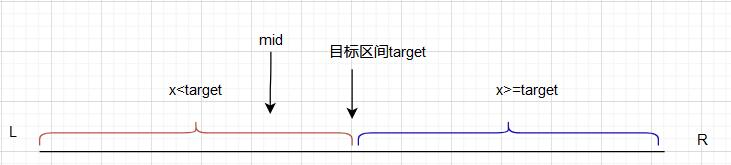
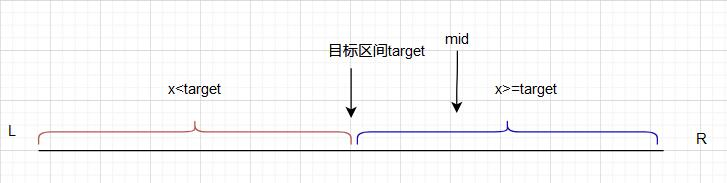
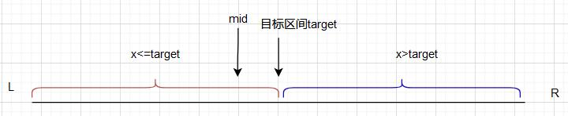
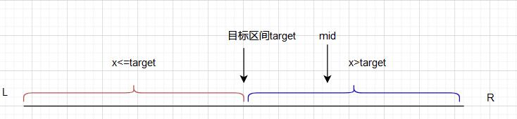
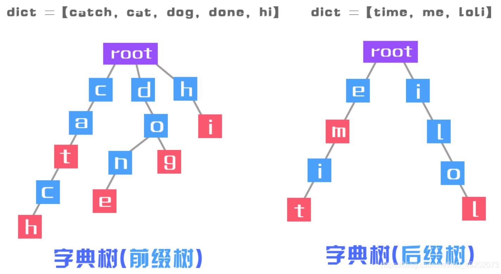
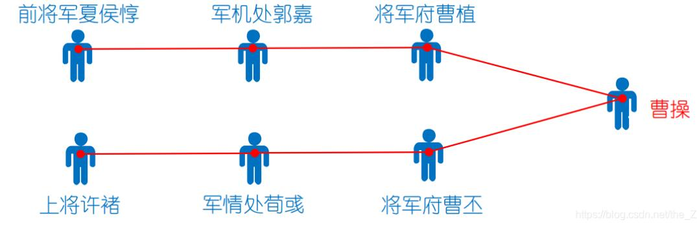
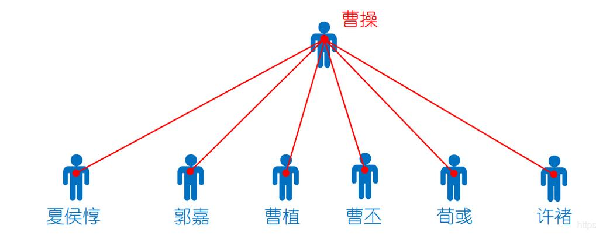
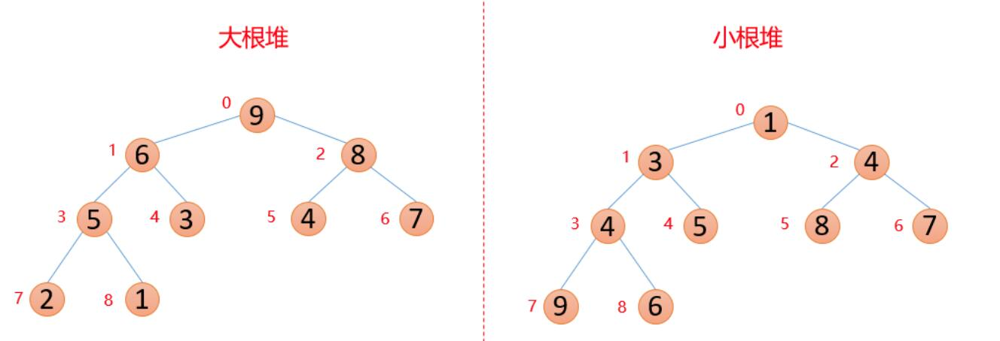
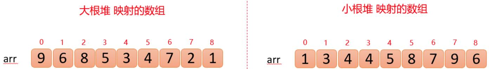

# Acwing-学习记录
## 基础算法
### 快速排序(时间复杂度`o(nlog2n)`)
1. 确定分界点`q[l]`,`q[2]`或者`q[(l+r)/2]`
2. 分段排列保证数组q前半段数字全部小于等于分界点，后半段全部大于等于分界点
   * 暴力法 (空间复杂度`o(n)`)
   * 双指针法 (空间复杂度`o(1)`)
3. 递归排序前半段与后半段
[快排模板](./代码模板/基础算法/快排.cpp)
### 归并排序(时间复杂度`o(nlog2n)`)
1. 确定分界点`q[(l+r)/2]`
2. 对左半段`(l,mid)`与右半段`(mid+1,r)`进行递归
3. 归并左半段与右半段(空间复杂度`o(n)`)
[归并排序模板](./代码模板/基础算法/归并排序.cpp)
### 二分查找(时间复杂度`o(nlog2n)`)
1. 整数二分
   1. 确定分界点mid，`mid=(l+r)/2`或者`mid=(l+r+1)/2`当需要将left更新为mid时使用`mid=(l+r+1)/2`
   2. 实现check函数，根据check函数重新确定区间
      + 当需要寻找值的左边界
        + 若`q[mid]<x`则目标区间应该在`[mid+1,right]`之中将`left=mid+1`
        + 若`q[mid]>=x`则目标区间应该在`[left,mid]`之中将`right=mid`
      + 当需要寻找值的右边界
        + 若`q[mid]<=x`则目标区间应该在`[mid,right]`之中将`left=mid`
        + 若`q[mid]>x`则目标区间应该在`[left,mid-1]`之中将`right=mid-1`
[整数二分查找模板](./代码模板/基础算法/整数二分查找.cpp)   
2. 浮点数二分
   浮点数二分较为简单可以直接看模板[浮点数二分查找模板](./代码模板/基础算法/浮点数二分.cpp) 
### 双指针算法
1. 对于两个序列，维护某种次序，比如归并排序中合并两个有序序列的操作
2. 对于一个序列，用两个指针维护一段区间
```
for (int i = 0, j = 0; i < n; i ++ )
{
    while (j < i && check(i, j)) j ++ ;
    // 具体问题的逻辑
}
```
[799. 最长连续不重复子序列](https://www.acwing.com/problem/content/description/801/)

### 位运算
1. 求n的第k位数字: `n >> k & 1`
2. 返回n的最后一位1：`lowbit(n) = n & -n`(`-n`是`n`取反之后加1，位与之后就可以得到n的最后一位1，例:`n=0110100`则`-n=1001100`,`n&-n=0000100`得到最后一位1处于第三位)

## 数据结构
### 链表与邻接表
1. 单链表：利用邻接表可以存储树与图
   [数组模拟单链表模板](./代码模板/数据结构/数组模拟单链表.cpp)
   [826. 单链表](https://www.acwing.com/problem/content/828/)
2. 双链表
   [数组模拟双链表模板](./代码模板/数据结构/数组模拟双链表.cpp)
   [827. 双链表](https://www.acwing.com/problem/content/829/)
### 栈与队列
1. 栈
   [数组模拟栈模板](./代码模板/数据结构/数组模拟栈.cpp)
   [828. 栈](https://www.acwing.com/problem/content/830/)
2. 普通队列
   [数组模拟普通队列模板](./代码模板/数据结构/数组模拟普通队列.cpp)
   [829. 队列](https://www.acwing.com/problem/content/831/)
3. 循环队列
   [数组模拟循环队列模板](./代码模板/数据结构/数组模拟循环队列.cpp)
   [829. 队列](https://www.acwing.com/problem/content/831/)
4. 单调栈
   [数组模拟单调栈模板](./代码模板/数据结构/数组模拟单调栈.cpp)
   [830. 单调栈](https://www.acwing.com/problem/content/832/)
   应用场景比较有限一般用于左边第一个比他小或者比他大的数
5. 单调队列
   [数组模拟单调队列模板](./代码模板/数据结构/数组模拟单调队列.cpp)
   [154. 滑动窗口 ](https://www.acwing.com/problem/content/156/)
6. 常用stl简介
   [常用stl](./代码模板/数据结构/常用stl.md)
### KMP
1. 确定next数组
  next数组是用于记录模板串回溯的大小假设模板串为```T[n]```,则```next[i]```就代表着```T[0...i-1]```的子串的最长公共真前后缀的长度,假设```next[i]=k```,则```T[0...k-1]```与```T[i-k...i-1]```相等。
  知道以上条件后我们来推推如何通过代码的方式得到整个next数组：
  首先一定有```next[0]=-1```和```next[1]=0```我们不妨设我们已知```next[i]=k```去求```next[i+1]```
   * ```T[k]=T[i]```:则易得```next[i+1]=k+1```
   * ```T[k]!=T[i]```:此时我们记$k_1$=```next[k]```,于是有```T[0...k1-1]=T[k-k1...k-1]```又因为```T[0...k-1]=T[i-k...i-1]```，故有```T[0...k1-1]=T[k-k1...k-1]=T[i−k...i−k+k1​−1]=t[i−k1​...i−1]```,即```T[0...k1−1] = T[i−k1...i−1]```。若```T[k1]```=```T[i]```,则根据情况1，```T[i+1]==K1+1```,否则另$k_2$=```next[k1]```，重复情况2，若在某一步发现$k_n$=-1，则表示已回溯到串头，则```next[i+1]=0```。可得求next数组如下
   ```
   vector<int> GetNum(string T){
         vector<int> next(T.size());
         next[0]=-1;
         int k,i=0;
         while(i<T.size()-1){
            k=next[i];
            if(T[i]==T[k]||k==-1){
                next[i++]=k+1;
            }
            else
                k=next[k];
         }
         return next;
   }
   ```
2. 根据next数组写KMP算法
```
int kmp(string &s,string &t) {
    vector<int> next = GetNext(t);
    int i = 0,j = 0;
    while (i < s.size() && j < (int) t.size()) {
        if (j == -1 || s[i] == t[j]) i++, j++;
        else j = next[j];
    }
    if (j == t.size()) return i - j;
    else return -1;
}
```
[KMP模板](./代码模板/数据结构/KMP.cpp)
[831. KMP字符串](https://www.acwing.com/problem/content/833/)  
[参考博客](https://blog.csdn.net/raelum/article/details/128823560)

### Trie树
【字典树】(Trie Tree) 是一种树形结构，是一种哈希树的变种。典型应用是用于统计，排序和保存大量的字符串（但不仅限于字符串）。
它的优点是：利用字符串的公共前缀来减少查询时间，最大限度地减少无谓的字符串比较，查询效率比哈希树高。

代码模板可看
[Trie树代码模板](./代码模板/数据结构/Trie树.cpp)
有插入和寻找两个方法
[835. Trie字符串统计](https://www.acwing.com/problem/content/837/)

### 并查集
并查集是一种树型的数据结构，用于处理一些不相交集合的合并及查询问题（即所谓的并、查）。比如说，我们可以用并查集来判断一个森林中有几棵树、某个节点是否属于某棵树等。

主要构成：
并查集主要由一个整型数组pre[ ]和两个函数find( )、join( )构成。
数组 pre[ ] 记录了每个点的前驱节点是谁，函数 find(x) 用于查找指定节点 x 属于哪个集合，函数 join(x,y) 用于合并两个节点 x 和 y 。

作用：
并查集的主要作用是求连通分支数（如果一个图中所有点都存在可达关系（直接或间接相连），则此图的连通分支数为1；如果此图有两大子图各自全部可达，则此图的连通分支数为2……）

1. find函数
```
int find(int x){
    if(pre[x]!=x)
        pre[x] = find(pre[x]);
    return pre[x];
}
```
这个find函数进行了路径优化，最后所有子节点都会挂载在同一个父节点之下


1. join函数
```
bool join(int x,int y){
    int pre_x = find(x);
    int pre_y = find(y);
    if(pre_x == pre_y)
        return false;
    //将节点少的挂在节点多的下面
    if(my_rank[pre_x]>my_rank[pre_y]){
        my_rank[pre_x]+=my_rank[pre_y];
        pre[pre_y] = pre_x;
    }
    else{
        my_rank[pre_y]+=my_rank[pre_x];
        pre[pre_x] = pre_y;
    }
    return true;
}
```
将节点少的分支挂载到节点多的分支下面可以优化寻找
[并查集代码模板](./代码模板/数据结构/并查集.cpp)
[837. 连通块中点的数量](https://www.acwing.com/problem/content/839/)

### 模拟堆排序
$~~~~~~$堆排序的时间复杂度O($N*\log{N}$),额外空间复杂度O(1)，是一个不稳定性的排序,堆的结构可以分为大根堆和小根堆，是一个完全二叉树，而堆排序是根据堆的这种数据结构设计的一种排序。
$~~~~~~$性质：每个结点的值都大于其左孩子和右孩子结点的值，称之为大根堆；每个结点的值都小于其左孩子和右孩子结点的值，称之为小根堆。如下图:

堆映射的数组如下

父结点索引：(i-1)/2（这里计算机中的除以2，省略掉小数）
左孩子索引：2*i+1
右孩子索引：2*i+2
如果栈顶编号从1开始则：
父结点索引：(i)/2（这里计算机中的除以2，省略掉小数）
左孩子索引：2*i
右孩子索引：2*i+1
堆排序步骤:
1. 首先将待排序的数组构造成一个大根堆，此时，整个数组的最大值就是堆结构的顶端(如果是想要降序排列的话就使用小根堆，后续步骤一致)
2. 将顶端的数与末尾的数交换，此时，末尾的数为最大值，剩余待排序数组个数为n-1
3. 将剩余的n-1个数再构造成大根堆，再将顶端数与n-1位置的数交换，如此反复执行，便能得到有序数组

堆的构造可以参考博客[堆排序算法（图解详细流程）](https://blog.csdn.net/u010452388/article/details/81283998)
